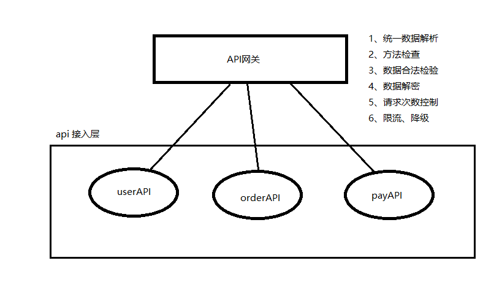

# Crowd  -- 按照这种格式来说明项目

####  项目介绍

java 版CMS系统、基于java技术研发的内容管理系统、功能：栏目模板自定义、内容模型自定义、多个站点管理、在线模板页面编辑等功能、代码完全开源、MIT授权协议。

技术选型：jfinal DB+Record mysql freemarker Encache spring 等 layui zTree bootstrap 。

特点：支持多站点、可以根据需求添加手机站、pc站。

项目地址：https://gitee.com/oufu/ofcms QQ 群: 185948056 欢迎喜欢开源的朋友一起加入，共同学习、群里有相关文档。

#### 目前版本v1.1.4 2019-03-11

1、修改评论不让IP提交 2、删除.idea文件 3、更新mysql驱动版本 4、评论提交ip地址不能访问 5、删除其它环境 6、微信模板菜单sql文件修改

#### 目前版本v1.1.3 2019-02-24

- 新增公告失败
- 用户删除失败
- PC端发布的文章在手机端访问报错
- 增加公众号消息模版推送
- 增加文章评论功能

#### 目前版本v1.1.2 2018-11-16

- 表单完善，功能增加单选、复选框、开关、选择框
- 文章编辑器更换ueditor
- 500页面修改
- 整理代码内部sql改到sql文件
- 用户登录禁止功能、
- 栏目刷新问题
- 修改admin默认跳转管理首页
- 未设置的访问地址为默认站点
- 增加文章关键字
- 首页图表显示不正确
- 缓存过期问题、出现查询无空
- 自动安装出现乱码
- 修改linux 安装sql报错

#### 版本v1.1.1 2018-09-06

前台：

- 1、默认两套网站 ，pc mobile
- 2、丰富模板标签
- 3、详细模板文档
- 4、支持分页，
- 5、单个网页，
- 6、两个站点要共用数据
- 7、漂亮的官网
- 8、自动引导安装、不需要修改配置文件、改数据库连接

后台：

- 1、后台两套首页模板，自由切换、主题切换
- 2、强大的前台控制，与后台分开。
- 3、功能开发简单，只要求配置请求地址即可，不需要处理js。
- 4、采用layui后台界面、效果大气。
- 5、架构设计复杂，使用简单，配置即可。
- 6、界面管理定时任务、不需求重启，自动，手动触发。
- 7、模板在线编辑，在线上传模板文件。
- 8、增加api接口模快，强大的封装。接口编写简单。

#### 项目团队

firechou (https://gitee.com/firechou)

王雪峰 (https://gitee.com/wangxfsh)

大寶 (https://gitee.com/zhouzhangl)

姚杰 (https://gitee.com/yaojiecd)

abpai (https://gitee.com/abpai)

luoyafeng (https://gitee.com/ExamSystem)

#### 项目功能

| 用户管理 | 菜单管理 | 角色管理 | 字典管理 | 机构管理 | 操作日志 | 连接池监视 | 定时任务 |
| -------- | -------- | -------- | -------- | -------- | -------- | ---------- | -------- |
| 基本设置 | 模板编辑 | 栏目管理 | 文章管理 | 主题管理 | 标签管理 | 回收站     | 广告管理 |
| 友情链接 | 评论管理 | 站点公告 | 站点管理 | 留言管理 | 微信管理 | 菜单管理   | 自动回复 |
| 默认回复 | 访问统计 | 评论统计 | 内容统计 | 表单管理 | 代码生成 | 通知管理   | 单页管理 |

#### 使用说明

1. 配置文件 resource/conf/admin.properties
2. 微信配置文件 resource/conf/weixin.properties
3. shiro 文件 resource/shiro.ini
4. 缓存 resource/ehcache.xml
5. 后台账号 http://localhost:8080/ofcms-admin/admin admin 密码 123456

### 项目依赖

- ofcms-core 核心
- ofcms-model 数据源
- ofcms-front 模板
- ofcms-api 接口
- 管理台
- ofcms-admin -> ofcms-core
- ofcms-admin -> ofcms-model
- ofcms-admin -> ofcms-front
- ofcms-admin -> ofcms-api

### 项目框架

#### api网关设计

### 部署说明

1. 建议采用 idea 工具开发
2. mysql 5.6+
3. jdk 1.8
4. tomcat 8 5.通过war包直接放TOMCAT下面 到附件中下载

#### 前台展示：

#### 端口号约定
| 项目 | 端口号 |
| -------- | -------- |
| crowdfunding-member-eureka  | 1000 | 
| crowdfunding-member-mysql-provider | 2000 | 
| crowdfunding-member-redis-provider | 3000 | 
| crowdfunding-member-authentication-consumer | 4000 | 
| crowdfunding-member-project-consumer | 5000 | 
| crowdfunding-member-order-consumer | 7000 | 
| crowdfunding-member-pay-consumer | 8000 | 
| crowdfunding-member-zuul | 80 | 

